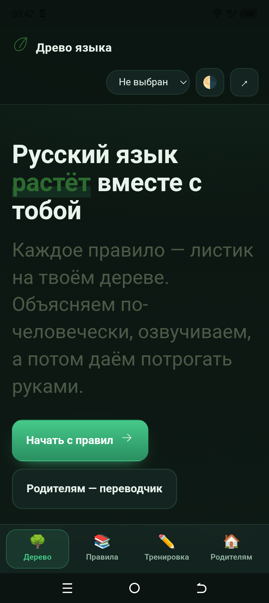
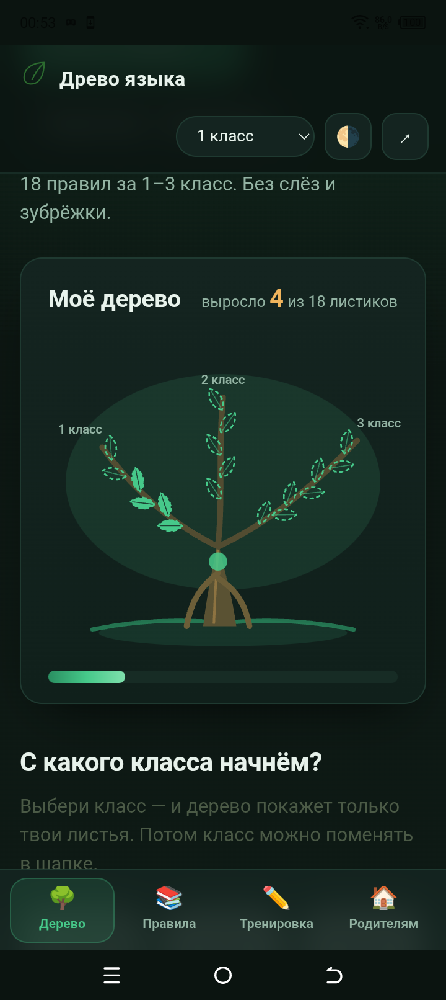
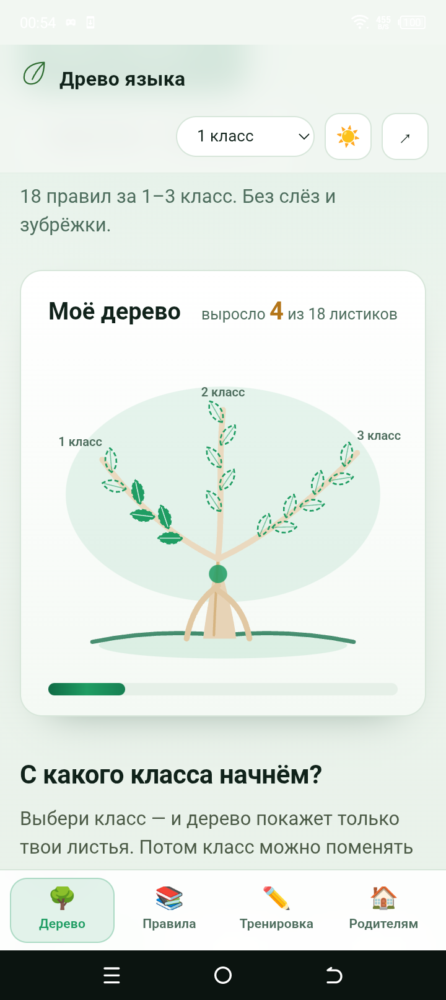
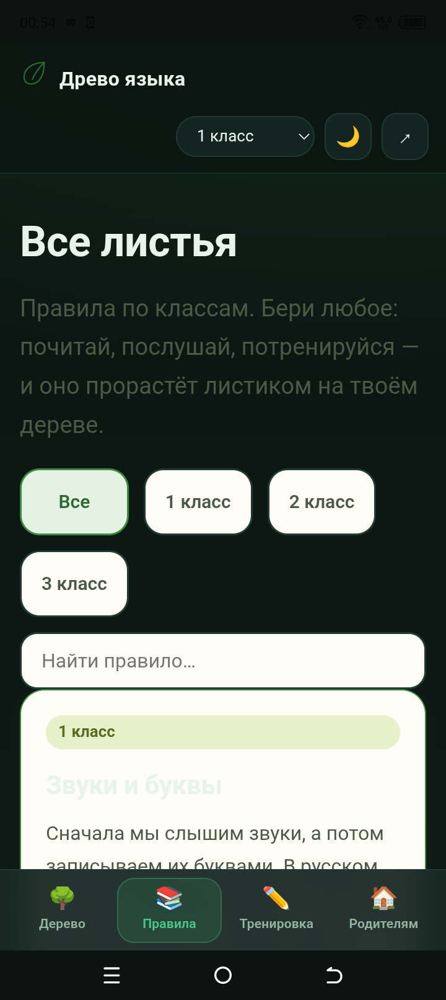

# Древо языка

Объяснялка по русскому языку для детей 1–3 классов. Правила из учебников переводятся на человеческий язык, озвучиваются и отрабатываются на тренажёре. Форк архитектуры RFC Garden: тот же движок, ноль зависимостей, ноль сборки — новая предметная область.

> **Древо языка** — то, чего не объяснили в учебнике.

## Что внутри

- **18 правил** (по ФГОС 1–3 класса): 6 на 1 класс (звуки, слоги, ударение, предложение), 5 на 2 класс (части речи, состав слова), 7 на 3 класс (члены предложения, орфография).
- Каждое правило — **паспорт**: человеческое объяснение (озвучивается через Web Speech API), «как написано в учебнике», живые примеры, «так нельзя», типичные ошибки, связи «выросло из».
- **Тренажёр** двух типов: «выбери правильное» и «кликни слово» (подлежащее, слог, запятую…).
- **Личное дерево** — прогресс в localStorage: каждое пройденное правило становится листиком.
- **Переводчик с учебникового** и **шпаргалка родителю** (печать).

## Как запустить

```
node tests/build-data.js      # пересобрать RULES.json из js/data.js
node tests/run-all.js         # прогнать все проверки
```

Сайт открывается через `file://`, работает без интернета (озвучка берёт системный голос браузера).

Проверки (`tests/`): целостность данных и классов (5–7 правил на класс), корректность вопросов тренажёра, синхронность data.js и RULES.json, битые ссылки в HTML, отсутствие i18n-хвостов, и `smoke-core.js` — исполнение логики в vm-контексте (прогресс, достижения, потоки тренажёра choice/tap, переводчик). Без зависимостей.

## Структура

- `js/data.js` — источник истины: правила + переводы.
- `RULES.json` — синхронный экспорт из data.js (генерируется, проверяется тестом).
- `index.html` — личное дерево, ветки-классы, достижения.
- `rule.html?id=…` — паспорт правила и встроенный тренажёр.
- `rules.html` — все листья с фильтром и поиском.
- `quiz.html` — тренировка по случайным вопросам класса.
- `parent.html` — переводчик и шпаргалка.
- `css/style.css` — один файл, анимации только на transform/opacity.
- `tests/` — проверки на чистом Node, без зависимостей.

## Философия

- Человеческий язык вместо канцелярита: задание ≤ 300 символов, без терминологической ватты.
- Без эмодзи в UI — только SVG-иконки.
- Ребёнок не зубрит формулировку — он применяет правило на тренажёре.
- Правила связаны в граф «выросло из», поэтому русский язык выглядит системой, а не списком.

## Критерий успеха

Показать ребёнку 7–9 лет. Если сказал «о, так понятно» — всё правильно.

## Приложение для Android

Сайт работает и в браузере, и как телефонное приложение. Оболочка — Capacitor,
папка `android-app/`: там же сборка, подпись и инструкция.

Что даёт приложение по сравнению с открытым сайтом:

- нижняя панель вкладок вместо верхнего меню — крупные цели для пальца;
- тёмная тема с переключателем «как в системе / тёмная / светлая», выбор
  сохраняется;
- статус-бар в тон теме;
- «Поделиться деревом» — прогресс выгружается в JSON через системное
  «Поделиться», на странице родителя есть обратная кнопка загрузки;
- **ни одного разрешения на интернет**: озвучка внутри приложения, синхронизации
  нет.

Ссылка на APK — в разделе Releases.

## Снимки с телефона

Все снимки сделаны на TECNO BF7 (Android 12) на подписанном APK.

### Главный экран: тёмная тема



### Своё дерево: пройденные листья залиты, остальные — контур



### Светлая тема



### Правила

