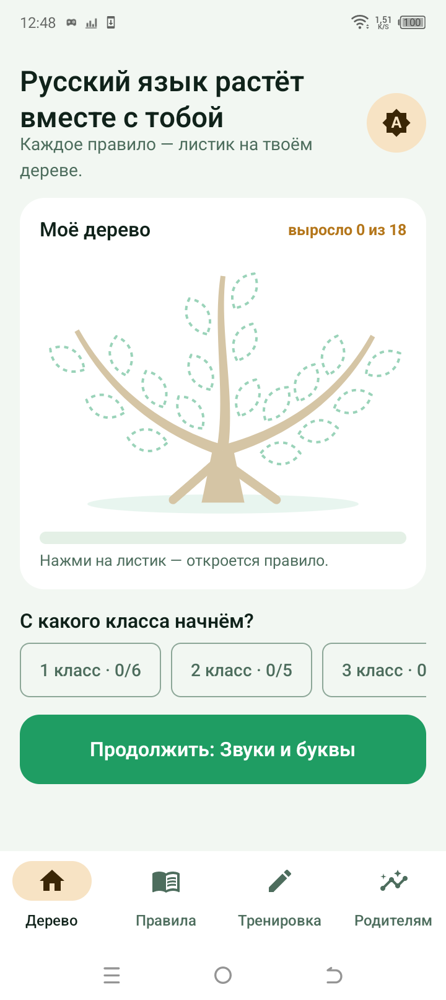
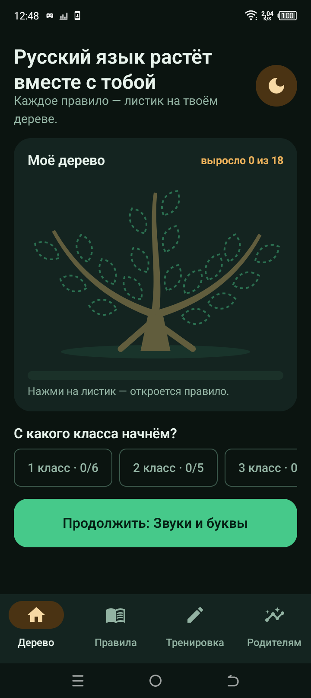
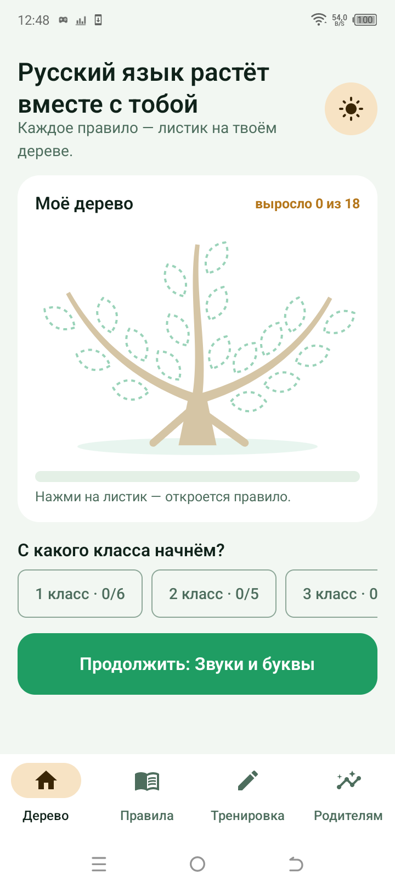
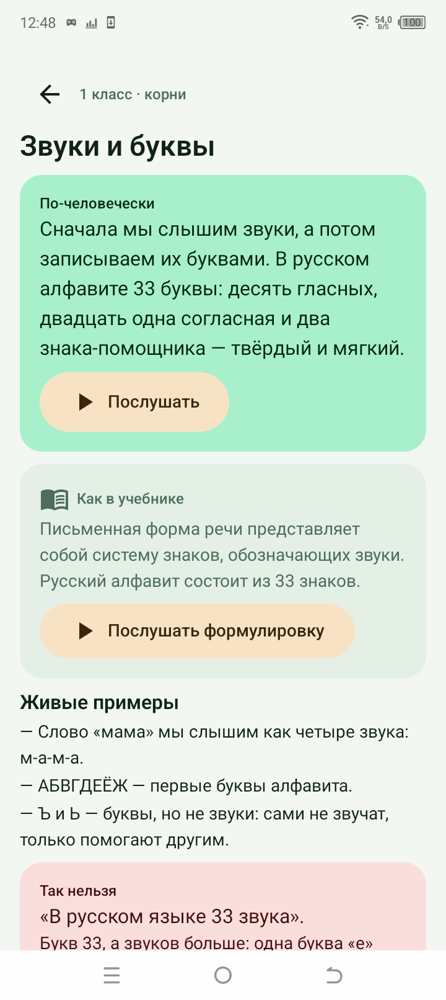
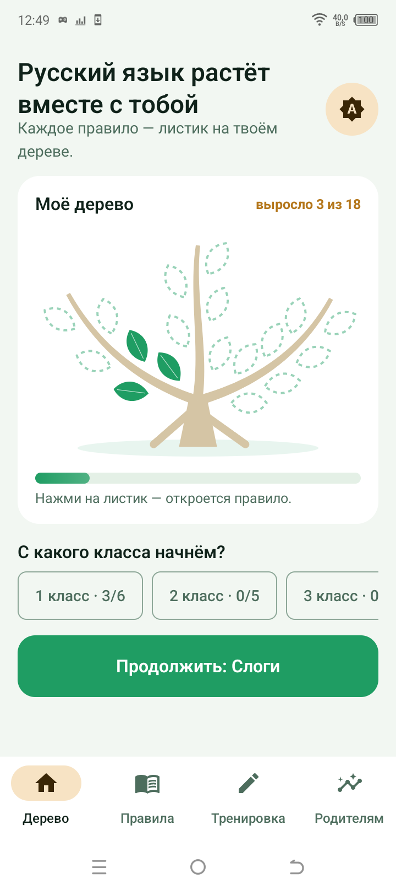
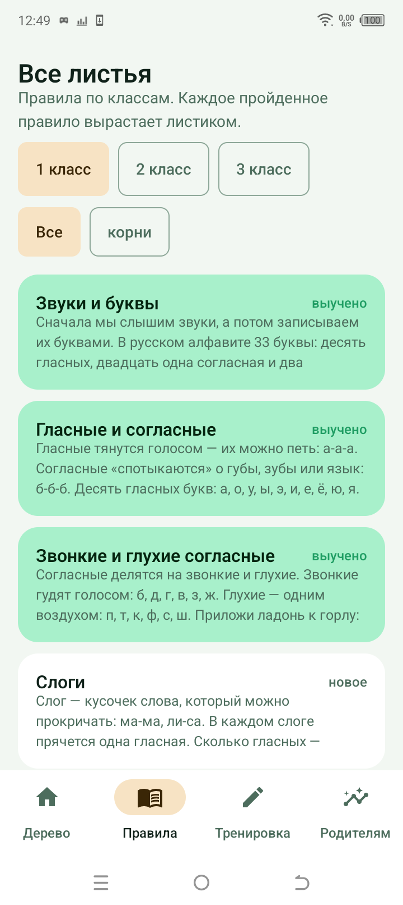
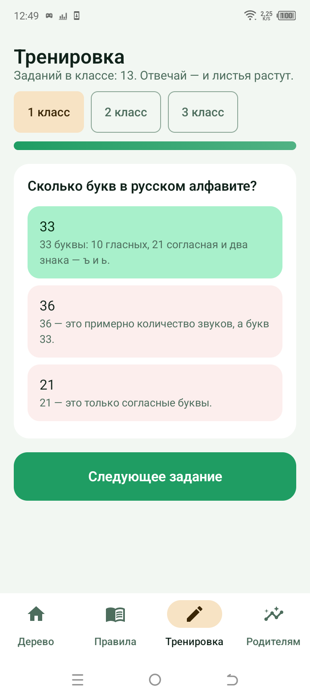
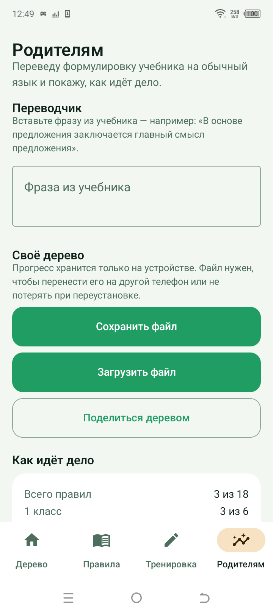

# Древо языка

Объяснялка по русскому языку для детей 1–3 классов. Правила из учебников переводятся на человеческий язык, озвучиваются и отрабатываются на тренажёре. Форк архитектуры RFC Garden: тот же движок, ноль зависимостей, ноль сборки — новая предметная область.

> **Древо языка** — то, чего не объяснили в учебнике.

## Что внутри

- **18 правил** (по ФГОС 1–3 класса): 6 на 1 класс (звуки, слоги, ударение, предложение), 5 на 2 класс (части речи, состав слова), 7 на 3 класс (члены предложения, орфография).
- Каждое правило — **паспорт**: человеческое объяснение (озвучивается через Web Speech API), «как написано в учебнике», живые примеры, «так нельзя», типичные ошибки, связи «выросло из».
- **Тренажёр** двух типов: «выбери правильное» и «кликни слово» (подлежащее, слог, запятую…).
- **Личное дерево** — прогресс в localStorage: каждое пройденное правило становится листиком.
- **Переводчик с учебникового** и **шпаргалка родителю** (печать).

## Как запустить

```
node tests/build-data.js      # пересобрать RULES.json из js/data.js
node tests/run-all.js         # прогнать все проверки
```

Сайт открывается через `file://`, работает без интернета (озвучка берёт системный голос браузера).

Проверки (`tests/`): целостность данных и классов (5–7 правил на класс), корректность вопросов тренажёра, синхронность data.js и RULES.json, битые ссылки в HTML, отсутствие i18n-хвостов, и `smoke-core.js` — исполнение логики в vm-контексте (прогресс, достижения, потоки тренажёра choice/tap, переводчик). Без зависимостей.

## Структура

- `js/data.js` — источник истины: правила + переводы.
- `RULES.json` — синхронный экспорт из data.js (генерируется, проверяется тестом).
- `index.html` — личное дерево, ветки-классы, достижения.
- `rule.html?id=…` — паспорт правила и встроенный тренажёр.
- `rules.html` — все листья с фильтром и поиском.
- `quiz.html` — тренировка по случайным вопросам класса.
- `parent.html` — переводчик и шпаргалка.
- `css/style.css` — один файл, анимации только на transform/opacity.
- `tests/` — проверки на чистом Node, без зависимостей.

## Философия

- Человеческий язык вместо канцелярита: задание ≤ 300 символов, без терминологической ватты.
- Без эмодзи в UI — только SVG-иконки.
- Ребёнок не зубрит формулировку — он применяет правило на тренажёре.
- Правила связаны в граф «выросло из», поэтому русский язык выглядит системой, а не списком.

## Критерий успеха

Показать ребёнку 7–9 лет. Если сказал «о, так понятно» — всё правильно.

## Приложение для Android

Сайт остаётся рабочим и открывается через `file://`. Телефонная версия
теперь **нативная** — Kotlin и Jetpack Compose, папка `android/`.

Что это дало по сравнению с обёрткой на Capacitor:

- дерево рисуется на `Canvas` по кривым Безье и остаётся пропорциональным
  на любом экране, а листья нажимаются — открывается нужное правило;
- озвучка лежит внутри APK (`SoundPool` по 36 mp3) и не зависит от
  системного голоса браузера;
- прогресс в `SharedPreferences`, файл выгружается через системный диалог
  «Поделиться» — без сети и без аккаунтов;
- светлая и тёмная темы «лес вечером» написаны отдельно, а не вывернуты
  одна из другой;
- **ни одного разрешения на интернет** в манифесте.

Старая обёртка `android-app/` сохранена в репозитории как история версии
1.0.0 и больше не собирается.

Сборка, тесты и подпись — в [`android/README.md`](android/README.md).
Ссылка на APK — в разделе Releases.

## Озвучка

Голос один на всё приложение: женский, спокойный, без спешки
(`ru-RU-SvetlanaNeural`, ровная подача — без замедления и поднятия тона).
В APK лежат 36 дорожек: по две на каждое из 18 правил, «человеческий
текст» и «учебниковая формулировка». Примеры в приложении не озвучиваются.

Экранный текст и текст для голоса — разные вещи. На экране ударений нет
(ребёнку не надо читать «сло́г» в книге), а в озвучку они попадают: русские
нейросетевые голоса ошибаются в ударениях, и это слышно как «голос с
акцентом». Слой, который превращает одно в другое, — `voice/tts-text.py`:

- ставит ударения из `voice/stress-ru.txt` (464 слова — все многосложные
  слова из текстов); слова короче трёх букв не размечаются никогда, иначе
  знак над буквой ломает произношение;
- не трогает слова, размеченные вручную, — в примере про омографы
  «Мука́» и «му́ка» различаются только знаком, словарь переписал бы оба
  одинаково;
- убирает цепочки одиночных букв («а-а-а»): голос читает их по именам,
  и фраза рассыпается; в кавычках сокращает до одной буквы («на «б»»);
- разворачивает числа и знаки, но не внутри конструкций вроде «под-ъ-езд».

Проверка `python voice/check-stress.py` (код возврата 0 — всё в порядке):
знак над гласной, нет латиницы, нет слов короче трёх букв, и главное —
каждое многосложное слово из `voice/texts.json` есть в словаре.

Веб-версия читает тот же подготовленный текст (`js/speech.js`, его собирает
`voice/gen-speech.py`), а не строку с экрана. Сборка APK
(`tools/build.ps1`) копирует свежие дорожки `voice/samples/` → `audio/` →
`android/app/src/main/res/raw/`, иначе в сборку молча попадает старый звук.

## Снимки с телефона

Все снимки сделаны на TECNO BF7 (Android 12) на подписанном APK 1.1.0
сценарием `device-lab` — без ручных кадров.

### Моё дерево



### Тёмная тема «лес вечером»



### Светлая тема



### Паспорт правила: объяснение и учебниковая формулировка



### Выученные листья: пройденное залито, остальное — пунктир



### Список правил



### Тренажёр



### Страница родителя: переводчик и файл прогресса

